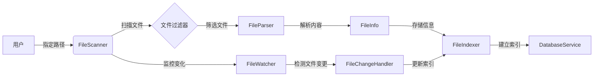

# EzyMemorAI 软件设计说明书
## Document Revision History
| Version | Date | Description | Author |
|---------|------|-------------|---------|
| v0.1 | 2024-01-XX | Initial draft | [Your Name] |

## Table of Contents
1. 引言
2. 系统架构设计
3. 详细设计
4. 接口设计
5. 数据设计
6. 部署方案
7. 安全设计
8. 测试计划

## 1. 引言
### 1.1 编写目的
本文档旨在详细描述EzyMemorAI系统的设计方案，作为开发实施的依据。

### 1.2 项目背景
EzyMemorAI是一个基于LLM的智能文件管理助手，旨在提供便捷的文件组织和智能问答功能。

### 1.3 定义与术语
- LLM: Large Language Model
- API: Application Programming Interface
- MVP: Minimum Viable Product

### 1.4 参考资料
- OpenAI API Documentation
- LangChain Documentation
- React/Vue.js Documentation

## 2. 系统架构设计
### 2.1 总体架构
#### 2.1.1 架构图
[插入系统架构图]

#### 2.1.2 技术栈选型
##### 前端技术栈
- 框架: React 18
- UI组件库: Ant Design 5.0
- 状态管理: Redux Toolkit
- 构建工具: Vite
- 类型系统: TypeScript

##### 后端技术栈
- 框架: FastAPI
- 数据库: PostgreSQL
- ORM: SQLAlchemy
- LLM集成: LangChain
- 文档处理: PyPDF2, python-docx

### 2.2 系统模块划分
#### 2.2.1 核心模块
1. 文件管理模块
2. LLM交互模块
3. 用户界面模块
4. 系统配置模块

#### 2.2.2 模块间关系
[插入模块关系图]

## 3. 详细设计

### 3.1 文件管理模块
#### 3.1.1 功能描述
- 文件系统扫描与监控
- 文件内容提取与解析
- 文件结构可视化
- 文件索引管理
- 文件变更追踪

#### 3.1.2 类设计
```python
class FileInfo:
    """文件信息数据类"""
    def __init__(self):
        self.id: str
        self.path: str
        self.name: str
        self.type: str
        self.size: int
        self.created_at: datetime
        self.modified_at: datetime
        self.content: str
        self.metadata: Dict

class FileScanner:
    """文件扫描器"""
    def scan_directory(self, path: str) -> List[FileInfo]:
        """扫描指定目录"""
        pass
    
    def watch_changes(self, path: str):
        """监控文件变化"""
        pass
    
    def filter_files(self, criteria: Dict) -> List[FileInfo]:
        """按条件筛选文件"""
        pass

class FileParser:
    """文件解析器"""
    def parse_file(self, file_path: str) -> str:
        """解析文件内容"""
        pass
    
    def extract_metadata(self, file_path: str) -> Dict:
        """提取文件元数据"""
        pass

class FileIndexer:
    """文件索引管理"""
    def create_index(self, files: List[FileInfo]):
        """创建文件索引"""
        pass
    
    def update_index(self, file_info: FileInfo):
        """更新索引"""
        pass
    
    def search_index(self, query: str) -> List[FileInfo]:
        """搜索索引"""
        pass
```

#### 3.1.3 工作流程
1. 初始扫描
2. 建立索引
3. 监控变化
4. 更新索引



### 3.2 LLM交互模块
#### 3.2.1 功能描述
- 模型配置管理
- 对话上下文管理
- 提示词模板管理
- 结果优化处理
- 错误处理和重试
- token使用统计

#### 3.2.2 类设计
```python
class LLMConfig:
    """LLM配置类"""
    def __init__(self):
        self.model_name: str
        self.api_key: str
        self.max_tokens: int
        self.temperature: float
        self.retry_count: int
        self.timeout: int

class PromptTemplate:
    """提示词模板"""
    def __init__(self):
        self.template: str
        self.variables: List[str]
    
    def format(self, **kwargs) -> str:
        """格式化提示词"""
        pass

class ConversationContext:
    """对话上下文管理"""
    def __init__(self):
        self.history: List[Dict]
        self.max_history: int
    
    def add_message(self, role: str, content: str):
        """添加消息"""
        pass
    
    def get_context(self) -> List[Dict]:
        """获取上下文"""
        pass
    
    def clear_context(self):
        """清除上下文"""
        pass

class LLMService:
    """LLM服务"""
    def __init__(self, config: LLMConfig):
        self.config = config
        self.context = ConversationContext()
    
    async def generate_response(self, prompt: str) -> str:
        """生成回复"""
        pass
    
    def optimize_response(self, response: str) -> str:
        """优化响应结果"""
        pass
    
    def handle_error(self, error: Exception):
        """错误处理"""
        pass
```

### 3.3 用户界面模块
#### 3.3.1 组件设计
##### FileExplorer组件
```typescript
interface FileExplorerProps {
    rootPath: string;
    onFileSelect: (file: FileInfo) => void;
}

class FileExplorer extends Component<FileExplorerProps> {
    state = {
        files: [],
        currentPath: '',
        loading: false
    };
    
    render() {
        // 渲染文件浏览器
    }
}
```

##### ChatInterface组件
```typescript
interface ChatInterfaceProps {
    context: ConversationContext;
    onSendMessage: (message: string) => Promise<void>;
}

class ChatInterface extends Component<ChatInterfaceProps> {
    state = {
        messages: [],
        inputValue: '',
        sending: false
    };
    
    render() {
        // 渲染聊天界面
    }
}
```

#### 3.3.2 状态管理
```typescript
// Redux Slice设计
interface AppState {
    files: {
        items: FileInfo[];
        loading: boolean;
        error: string | null;
    };
    chat: {
        messages: Message[];
        context: ConversationContext;
        sending: boolean;
    };
    settings: {
        llmConfig: LLMConfig;
        generalSettings: GeneralSettings;
    };
}

const fileSlice = createSlice({
    name: 'files',
    initialState,
    reducers: {
        // 文件相关reducers
    }
});

const chatSlice = createSlice({
    name: 'chat',
    initialState,
    reducers: {
        // 聊天相关reducers
    }
});
```

### 3.4 系统配置模块
#### 3.4.1 配置项设计
```typescript
interface SystemConfig {
    llm: {
        provider: 'openai' | 'azure' | 'local';
        apiKey: string;
        modelConfig: LLMConfig;
    };
    storage: {
        type: 'local' | 'cloud';
        path: string;
        maxSize: number;
    };
    security: {
        encryption: boolean;
        authRequired: boolean;
        tokenExpiration: number;
    };
    performance: {
        maxConcurrent: number;
        cacheStrategy: 'memory' | 'disk';
        cacheTTL: number;
    };
}
```

#### 3.4.2 配置管理类
```python
class ConfigManager:
    """配置管理器"""
    def __init__(self):
        self.config: SystemConfig = None
    
    def load_config(self, path: str):
        """加载配置"""
        pass
    
    def save_config(self):
        """保存配置"""
        pass
    
    def update_config(self, updates: Dict):
        """更新配置"""
        pass
    
    def validate_config(self) -> bool:
        """验证配置"""
        pass
```

### 3.5 数据持久化模块
#### 3.5.1 数据模型
```python
class FileModel(Base):
    """文件数据模型"""
    __tablename__ = 'files'
    
    id = Column(String, primary_key=True)
    path = Column(String, nullable=False)
    content = Column(Text)
    metadata = Column(JSON)
    created_at = Column(DateTime, default=datetime.utcnow)
    updated_at = Column(DateTime, onupdate=datetime.utcnow)

class ChatModel(Base):
    """聊天记录模型"""
    __tablename__ = 'chats'
    
    id = Column(String, primary_key=True)
    user_id = Column(String)
    messages = Column(JSON)
    created_at = Column(DateTime, default=datetime.utcnow)

class SettingsModel(Base):
    """设置数据模型"""
    __tablename__ = 'settings'
    
    key = Column(String, primary_key=True)
    value = Column(JSON)
    updated_at = Column(DateTime, onupdate=datetime.utcnow)
```

#### 3.5.2 数据访问层
```python
class DatabaseService:
    """数据库服务"""
    def __init__(self, session_factory):
        self.session_factory = session_factory
    
    async def save_file_info(self, file_info: FileInfo):
        """保存文件信息"""
        pass
    
    async def get_file_info(self, file_id: str) -> FileInfo:
        """获取文件信息"""
        pass
    
    async def save_chat_history(self, chat: ChatModel):
        """保存聊天记录"""
        pass
    
    async def get_chat_history(self, user_id: str) -> List[ChatModel]:
        """获取聊天记录"""
        pass
```

### 3.6 异常处理设计
```python
class EzyMemorAIException(Exception):
    """基础异常类"""
    pass

class FileOperationError(EzyMemorAIException):
    """文件操作异常"""
    pass

class LLMError(EzyMemorAIException):
    """LLM相关异常"""
    pass

class ConfigError(EzyMemorAIException):
    """配置相关异常"""
    pass

def error_handler(error: Exception):
    """全局错误处理器"""
    if isinstance(error, EzyMemorAIException):
        # 处理已知异常
        pass
    else:
        # 处理未知异常
        pass
```

### 3.7 性能优化设计
#### 3.7.1 缓存策略
```python
class CacheService:
    """缓存服务"""
    def __init__(self, strategy: str):
        self.strategy = strategy
    
    async def get(self, key: str):
        """获取缓存"""
        pass
    
    async def set(self, key: str, value: Any, ttl: int = None):
        """设置缓存"""
        pass
    
    async def invalidate(self, pattern: str):
        """失效缓存"""
        pass
```

#### 3.7.2 并发控制
```python
class RateLimiter:
    """速率限制器"""
    def __init__(self, max_concurrent: int):
        self.semaphore = asyncio.Semaphore(max_concurrent)
    
    async def acquire(self):
        """获取令牌"""
        pass
    
    async def release(self):
        """释放令牌"""
        pass
```

## 4. 接口设计
### 4.1 API接口
#### 4.1.1 文件管理接口
```yaml
/api/files:
  get:
    description: 获取文件列表
    parameters:
      - name: path
        in: query
        type: string
    responses:
      200:
        description: 成功返回文件列表
```

### 4.2 内部接口
[详细的内部接口设计]

## 5. 数据设计
### 5.1 数据库设计
#### 5.1.1 ER图
[插入ER图]

#### 5.1.2 表结构
```sql
CREATE TABLE files (
    id SERIAL PRIMARY KEY,
    path VARCHAR(255) NOT NULL,
    content TEXT,
    created_at TIMESTAMP DEFAULT CURRENT_TIMESTAMP
);
```

### 5.2 缓存设计
- Redis缓存策略
- 缓存失效机制

## 6. 部署方案
### 6.1 部署架构
#### 6.1.1 私有化部署
```yaml
version: '3'
services:
  backend:
    build: ./backend
    ports:
      - "8000:8000"
  frontend:
    build: ./frontend
    ports:
      - "3000:80"
```

#### 6.1.2 云端部署
[云端部署方案详情]

## 7. 安全设计
### 7.1 身份认证
- JWT认证机制
- Token刷新策略

### 7.2 数据安全
- 文件加密存储
- 传输加密
- 权限控制

## 8. 测试计划
### 8.1 单元测试
```python
def test_file_scanner():
    scanner = FileScanner()
    results = scanner.scan_directory("./test_dir")
    assert len(results) > 0
```

### 8.2 集成测试
[集成测试计划]

### 8.3 性能测试
- 并发用户数: 100
- 响应时间要求: < 500ms
- 资源占用限制

## 9. 项目规划
### 9.1 开发计划
#### Phase 1: 基础框架 (2周)
- 项目初始化
- 基础架构搭建
- 核心功能原型

#### Phase 2: 核心功能 (4周)
- 文件管理实现
- LLM集成
- 基础UI实现

#### Phase 3: 功能完善 (3周)
- 高级特性
- 性能优化
- Bug修复

### 9.2 风险评估
| 风险 | 可能性 | 影响 | 缓解措施 |
|------|--------|------|----------|
| LLM API成本 | 高 | 中 | 实现本地模型选项 |
| 性能问题 | 中 | 高 | 优化算法和缓存 |

## 10. 附录
### 10.1 工具链
- 开发IDE: VSCode
- 版本控制: Git
- CI/CD: GitHub Actions
- 文档工具: Markdown

### 10.2 编码规范
- Python: PEP 8
- JavaScript: Airbnb Style Guide
- 提交信息: Conventional Commits